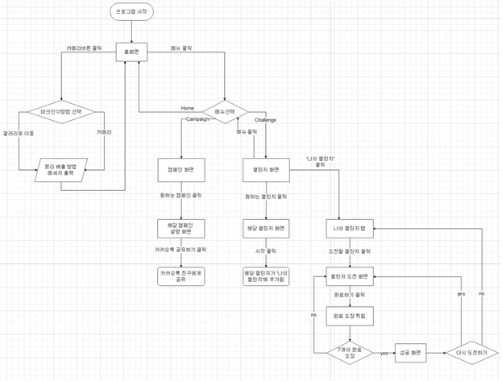
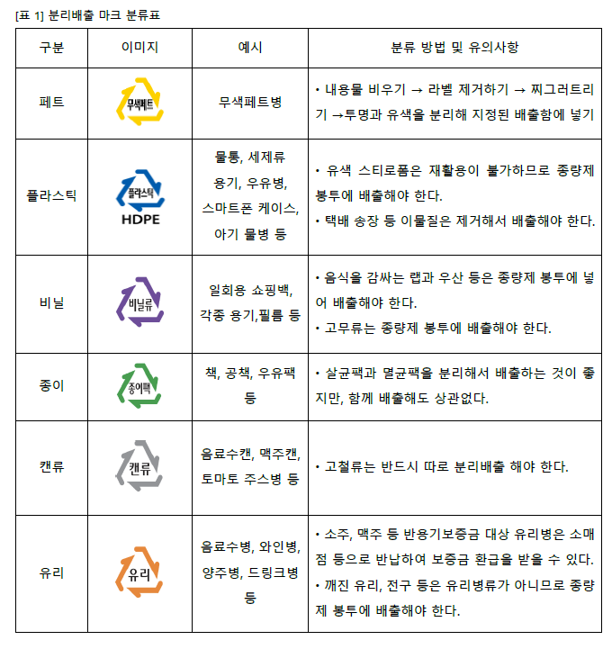
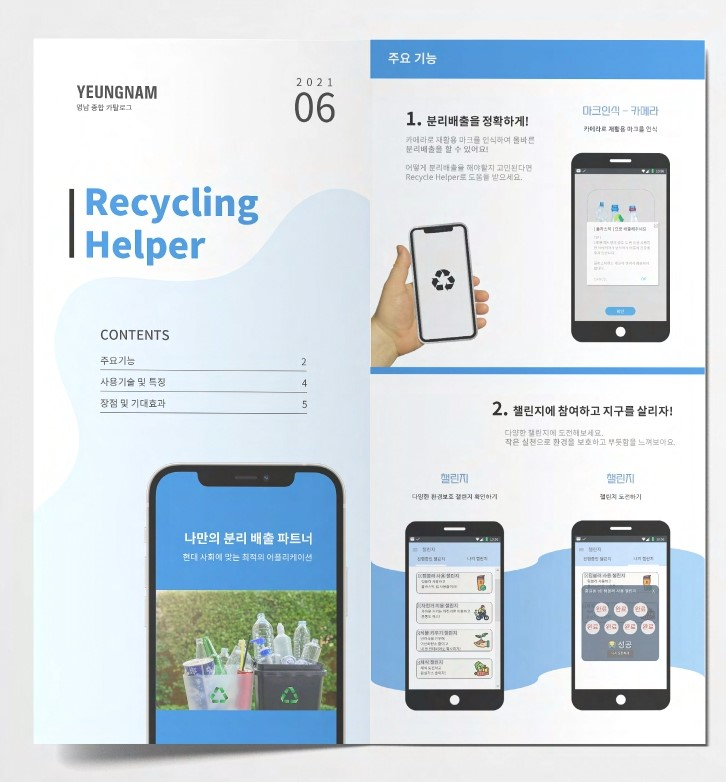
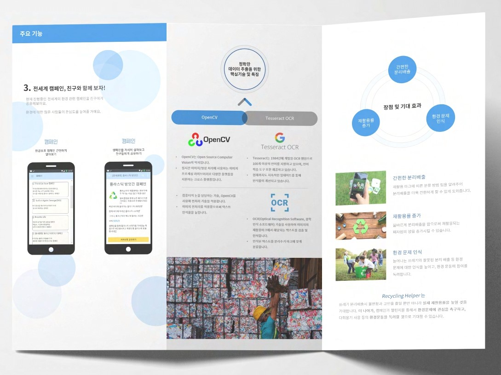

# RecyclingHelper 
       
  

**Capstone Design 졸업과제**  
2021-04-05 ~ 2021-11-29 진행

카메라로 재활용 쓰레기의 재활용 마크를 찍으면, 쓰레기의 소재를 구분하고 정확한 분리배출 방법을 알려주는 안드로이드 어플입니다. 환경 관련 캠페인 소개 및 챌린지 기능을 제공합니다.
  

     
목차

  - [기능 및 역할분담](#1-기능-및-역할분담)  
  - [사용 기술](#2-사용-기술)  
  - [산출 문서](#3-산출-문서)  
    - [플로우 차트](#4-플로우-차트)  
  - [재활용품 분류 기준](#5-재활용품-분류-기준)  
  - [사용 안내](#6-사용-안내)

  

## 기능 및 역할분담

- **재활용 마크 인식 및 분류** - 송유진(팀장), 최지원, 권세희
- **환경 캠페인 안내** - 김정은, 황영윤
- **환경 챌린지 참여** - 김정은, 황영윤

## 사용 기술

- Java 11
- C++
- Android
- Gradle
- OpenCV
- Tesseract API
- SQLite

## 산출 문서

- [요구사항 문서](https://docs.google.com/document/d/1G3Z9FQkNhMRGHjozTetWniI2VK_3IKHNZxWFTil1u90/edit?usp=sharing)

- [최종 보고서](https://docs.google.com/document/d/1CePAl9TbC8ctGSAOvcUSv4GbObWp1bQcSOTJHJ5mCSo/edit?usp=sharing)

## 플로우 차트

## 재활용품 분류 기준

## 사용 안내

